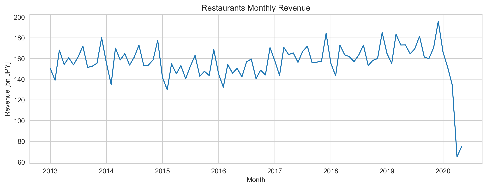

# Pandas e-Stat

[](https://pypi.org/project/pandas-estat/)
[](https://pypi.org/project/pandas-estat/)
[](https://travis-ci.com/simaki/pandas-estat)
[](https://codecov.io/gh/simaki/pandas-estat)
[](https://pypi.org/project/pandas_estat/)
[](LICENSE)
[](https://github.com/psf/black)

[政府統計総合窓口 e-Stat](https://www.e-stat.go.jp/) の統計データを `pandas.DataFrame` 形式で取得します。

## インストール

```sh
pip install pandas-estat
```

## 使い方

全国飲食店の売上データを例に、Pandas e-Stat の使い方を説明します。

使い方は三手順です。

1. e-Stat アプリケーション ID を設定する
2. 統計データ一覧を取得する
3. 統計データを取得する

### 1. e-Stat アプリケーション ID を設定する

[e-Stat API 機能](https://www.e-stat.go.jp/api/) からユーザ登録し、マイページからアプリケーション ID を発行します。
名称は好きな名前を入力します。URL は、公開サイトで利用しない場合 `http://test.localhost/` 等を入力します（参考: [API 利用ガイド](https://www.e-stat.go.jp/api/api-info/api-guide)）。
名称・URL・概要はあとから変更できます。

右の「発行」ボタンをクリックすると表示される "appId" が、e-Stat API のアプリケーション ID です。
人に漏らさないよう注意してください。


発行したアプリケーション ID は、環境変数 `ESTAT_APPID` に設定するか、`set_appid` で設定します。

```sh
export ESTAT_APPID="YOUR_APPLICATION_ID"
```

```python
import pandas as pd
import pandas_estat

pandas_estat.set_appid("YOUR_APPLICATION_ID")
```

### 2. 統計データ一覧を取得する

e-Stat API が提供する統計データは、[e-Stat 提供データ](https://www.e-stat.go.jp/api/api-info/api-data) から確認できます。

全国飲食店の売上のデータは、例えば「サービス産業動向調査」に入っているので、これを取得しましょう。
左の 8 桁の数字 `00200544` が「**政府統計コード**」で、該当する統計データの一覧を得るために必要です。


関数 `read_statslist` は、政府統計コードから統計データの一覧を `pandas.DataFrame` 形式で取得します。

サービス産業動向調査の統計データ一覧は次の通りです。

```python
from pandas_estat import read_statslist

statslist = read_statslist("00200544")  # サービス産業動向調査
statslist
#       TABLE_INF STAT_CODE  ... SUB_CATEGORY_CODE SUB_CATEGORY
# 0    0003179100  00200544  ...                02         需給流通
# 1    0003179101  00200544  ...                02         需給流通
# 2    0003085562  00200544  ...                02         需給流通
# 3    0003085612  00200544  ...                02         需給流通
# 4    0003090498  00200544  ...                02         需給流通
# ..          ...       ...  ...               ...          ...
# 137  0003412789  00200544  ...                02         需給流通
# 138  0003412790  00200544  ...                02         需給流通
# 139  0003412791  00200544  ...                02         需給流通
# 140  0003412792  00200544  ...                02         需給流通
# 141  0003412793  00200544  ...                02         需給流通
#
# [142 rows x 35 columns]
```

月次の売上高は、次の表の二行目の「事業活動の産業（中分類）別売上高（月次）【2013年1月～】」です。

一列目 `TABLE_INF` の数字 `0003191203` が「**統計表 ID**」で、統計データを得るために必要です。

```python
statslist = statslist[statslist.CYCLE == "月次"]
statslist[["TABLE_INF", "TITLE"]]
#      TABLE_INF                                              TITLE
# 2   0003085562    事業所・企業等の産業（中分類）別売上高，従業上の地位別事業従事者数（月次）【2013年1月～】
# 5   0003191203                     事業活動の産業（中分類）別売上高（月次）【2013年1月～】
# 7   0003085489               事業活動の産業（中分類）別需要の状況【2013年1月～2016年12月】
# 8   0003085521  事業活動の産業（中分類），事業所・企業等の産業（中分類）別売上高（月次）【2013年1月～12月】
# 10  0003094573  事業活動の産業（一部中分類），事業所・企業等の産業（一部中分類）別売上高（月次）【2013年...
```

### 3. 統計データを取得する

統計表 ID から、飲食店売上高のデータを取得しましょう。

関数 `read_statsdata` は、統計表 ID から統計データを `pandas.DataFrame` 形式で取得します。

取得された表データは次の通りです。
さまざまな産業（通信、放送、飲食店、…）の売上高やその合計が、ひとつの表に格納されています。

```python
from pandas_estat import read_statsdata

dataframe = read_statsdata("0003191203")  # 事業活動の産業（中分類）別売上高（月次）【2013年1月～】

dataframe
#      tab_code      表章項目 cat01_code 事業活動の産業  ...    時間軸（月次） unit     value annotation
# 0         001  売上高（収入額）      00000      合計  ...    2013年1月  百万円  27331888        NaN
# 1         001  売上高（収入額）      00000      合計  ...    2013年2月  百万円  27395304        NaN
# 2         001  売上高（収入額）      00000      合計  ...    2013年3月  百万円  35140562        NaN
# 3         001  売上高（収入額）      00000      合計  ...    2013年4月  百万円  28676427        NaN
# 4         001  売上高（収入額）      00000      合計  ...    2013年5月  百万円  28648626        NaN
# ...       ...       ...        ...     ...  ...        ...  ...       ...        ...
# 4411      001  売上高（収入額）      20000     その他  ...    2020年4月  百万円    791637        NaN
# 4412      001  売上高（収入額）      20000     その他  ...    2020年5月  百万円    753034        NaN
# 4413      001  売上高（収入額）      20000     その他  ...  2020年6月 p  百万円    844858        NaN
# 4414      001  売上高（収入額）      20000     その他  ...  2020年7月 p  百万円    809144        NaN
# 4415      001  売上高（収入額）      20000     その他  ...  2020年8月 p  百万円    798929        NaN
#
# [4416 rows x 11 columns]

set(dataframe["事業活動の産業"])
# {'37通信業',
# '38放送業',
# '39情報サービス業',
# ...
# '76飲食店',
# ...
# '合計',
# ...
# 'Ｒサービス業（他に分類されないもの）\u3000（※「政治・経済・文化団体」、「宗教」及び「外国公務」を除く）'}
```

表データから、飲食店・月次のみを抽出して、日付をパースし、日付でソートします。
これで、全国飲食店の月次売上高が取得できました。単位は百万円です。

```python
dataframe = dataframe[dataframe["事業活動の産業"] == "76飲食店"]
dataframe = dataframe[dataframe["時間軸（月次）"].str.endswith("月")]
dataframe["時間軸（月次）"] = pd.to_datetime(dataframe["時間軸（月次）"], format="%Y年%m月")
dataframe = dataframe.sort_values("時間軸（月次）")

dataframe[["時間軸（月次）", "value", "unit"]]
#         時間軸（月次）    value unit
# 2392 2013-01-01  1502478  百万円
# 2393 2013-02-01  1389255  百万円
# 2394 2013-03-01  1680085  百万円
# 2395 2013-04-01  1541662  百万円
# 2396 2013-05-01  1606195  百万円
# ...         ...      ...  ...
# 2476 2020-01-01  1660809  百万円
# 2477 2020-02-01  1509541  百万円
# 2478 2020-03-01  1342779  百万円
# 2479 2020-04-01   650055  百万円
# 2480 2020-05-01   747595  百万円
#
# [89 rows x 3 columns]
```

次のようにして、全国飲食店の売上高の推移がプロットできます。

```python
import matplotlib.pyplot as plt
import seaborn

seaborn.set_style("whitegrid")

x = dataframe["時間軸（月次）"].values
y = dataframe["value"].values.astype(float) / 10e3  # 十億円

plt.figure(figsize=(12, 4))
plt.plot(x, y)
plt.title("Restaurants Monthly Revenue")
plt.xlabel("Month")
plt.ylabel("Revenue [bn JPY]")
plt.savefig("restaurants.png", dpi=300)
plt.show()
```



## クレジット

このサービスは、政府統計総合窓口(e-Stat)のAPI機能を使用していますが、サービスの内容は国によって保証されたものではありません。

## 謝辞

* [sinhrks/japandas](https://github.com/sinhrks/japandas)
